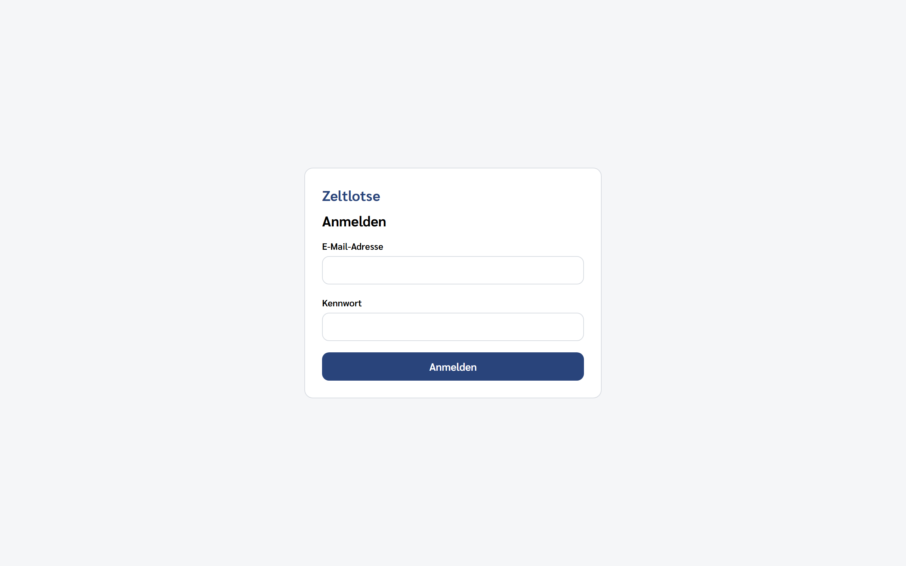
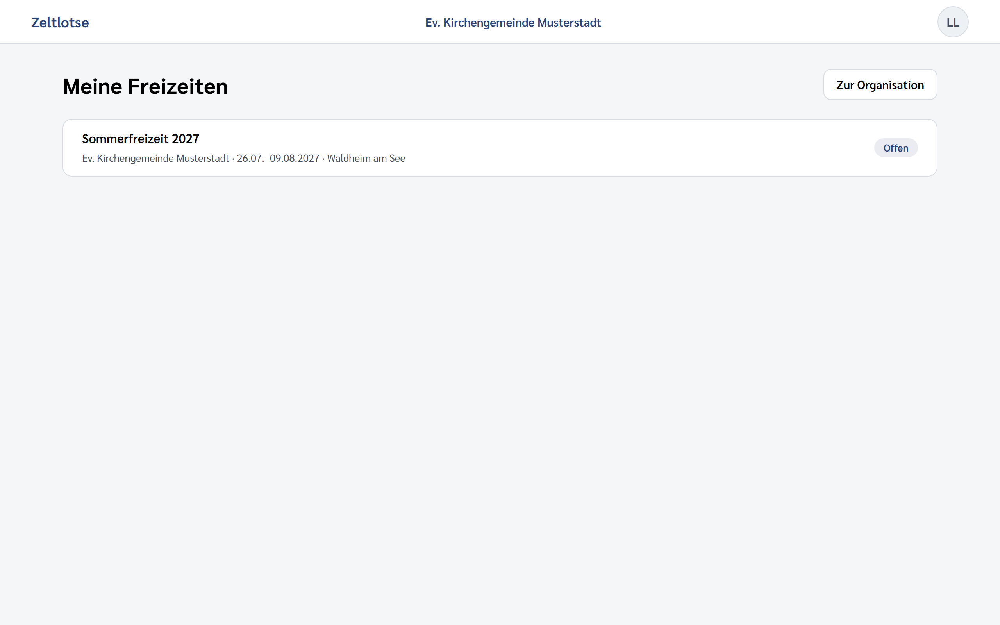
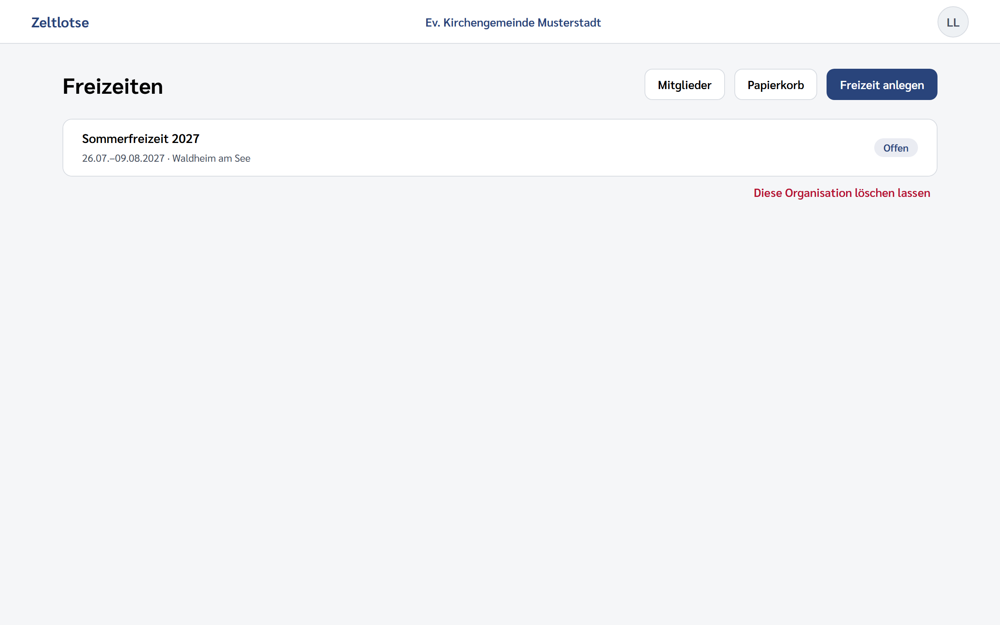
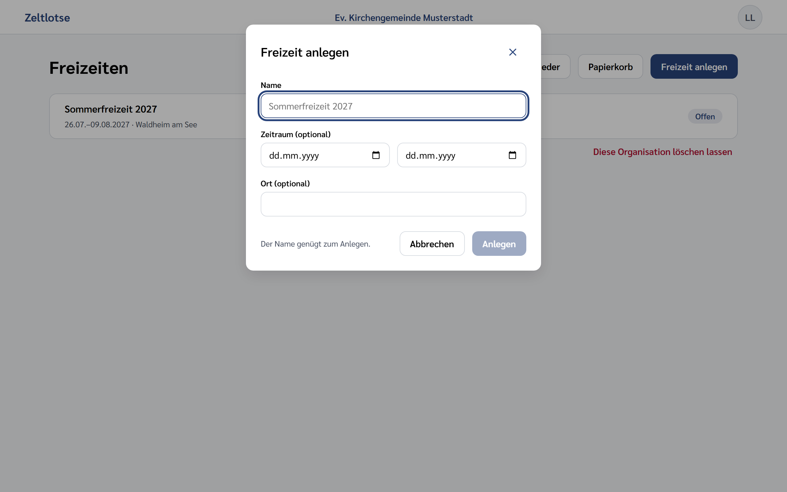
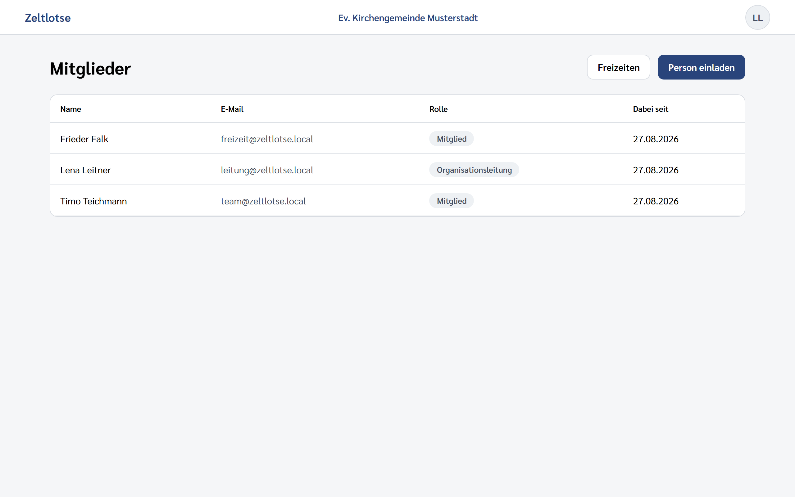
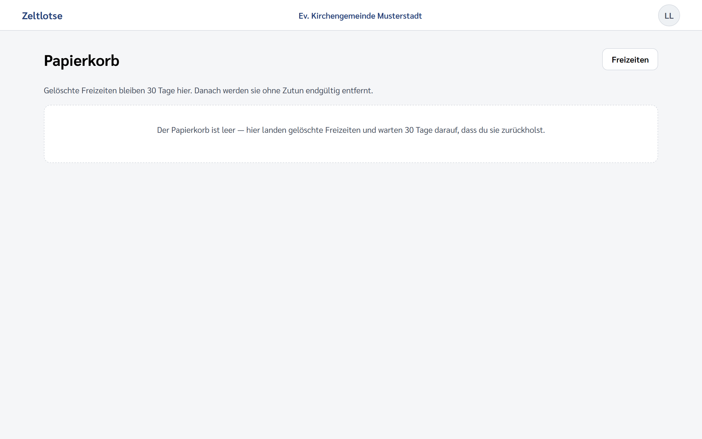
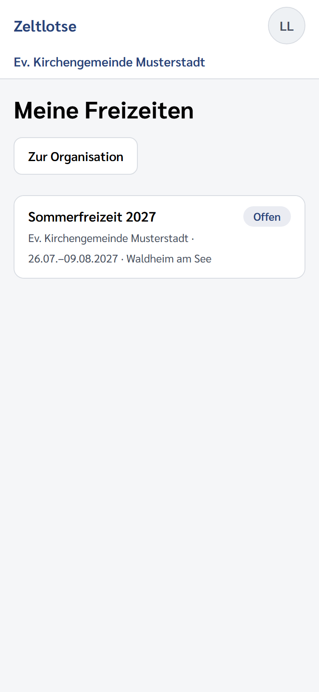

# Erste Schritte

Zeltlotse ist das Planungswerkzeug für christliche Freizeiten. Diese Anleitung
führt dich durch deine ersten Handgriffe.

## 1. Anmelden

Du bekommst von deiner Organisationsleitung einen **Einladungslink** — meist per
Nachricht oder persönlich weitergegeben, nicht per E-Mail. Öffne ihn, vergib ein
Kennwort, fertig.

Beim nächsten Mal meldest du dich mit E-Mail-Adresse und Kennwort an:

Du bleibst angemeldet, auch wenn du den Browser zwischendurch schließt. Erst nach
30 Tagen ohne Besuch musst du dein Kennwort wieder eingeben.

> **Achtung:** Ein Einladungslink funktioniert genau einmal und läuft nach 14
> Tagen ab. Klappt er nicht mehr, bitte um eine neue Einladung — der alte Link
> lässt sich nicht wiederbeleben.

## 2. Deine Freizeiten finden

Nach der Anmeldung stehen alle Freizeiten da, zu denen du gehörst — auch über
mehrere Organisationen hinweg. In der zweiten Zeile steht jeweils, zu welcher
Organisation eine Freizeit gehört, wann sie stattfindet und wo.

Steht dort „Zeitraum offen", ist noch kein Datum eingetragen. Das ist kein
Fehler, sondern der Normalfall in der Vorbereitung.

Ein Klick auf eine Zeile öffnet die Freizeit.

## 3. Eine Freizeit anlegen

Nur die Organisationsleitung darf das. Gehe in deine Organisation und klicke
oben rechts auf **Freizeit anlegen**:

Es öffnet sich ein kleines Fenster. Der Mauszeiger steht schon im Namensfeld:

**Tippe den Namen und drücke Enter — das genügt.** Zeitraum und Ort tragen sich
später nach, wenn sie feststehen. Mit `Esc` schließt du das Fenster, ohne etwas
anzulegen.

## 4. Menschen dazuholen

Es gibt zwei Wege, und sie führen an verschiedene Orte:

- **Mitglieder** (in der Organisation) — die Person gehört danach zur
  Organisation, aber noch zu keiner Freizeit.
- **Person einladen** (in einer Freizeit) — die Person kommt in die Organisation
  *und* in genau diese Freizeit.

In beiden Fällen erzeugt Zeltlotse einen Link. **Kopiere ihn sofort und gib ihn
selbst weiter** — Zeltlotse verschickt keine E-Mails. Der Link erscheint nur ein
einziges Mal; danach lässt er sich aus Sicherheitsgründen nicht erneut anzeigen.
Ist er verloren gegangen, findest du die Einladung unter „Offene Einladungen"
und klickst dort auf **„Neuen Link erzeugen"** — der alte verfällt dabei.

Wenn jemand **bereits zur Organisation gehört** und nur in eine Freizeit soll,
brauchst du gar keine Einladung: In der Freizeit selbst steht unter „Team" das
Feld **„Mitglied hinzufügen"** mit allen, die noch nicht dabei sind.

## 5. Etwas versehentlich gelöscht?

Gelöschte Freizeiten sind nicht weg. Sie liegen **30 Tage** im Papierkorb deiner
Organisation und lassen sich von dort zurückholen:

Nach Ablauf der Frist verschwinden sie ohne weiteres Zutun — dann hilft auch die
Organisationsleitung nicht mehr.

## Unterwegs

Zeltlotse ist für den Laptop gemacht, funktioniert aber auch am Handy:

---

Die Bilder in dieser Anleitung werden erzeugt, nicht von Hand aufgenommen:
`dotnet run --project tools/Zeltlotse.Screenshots` bei laufender Anwendung.
